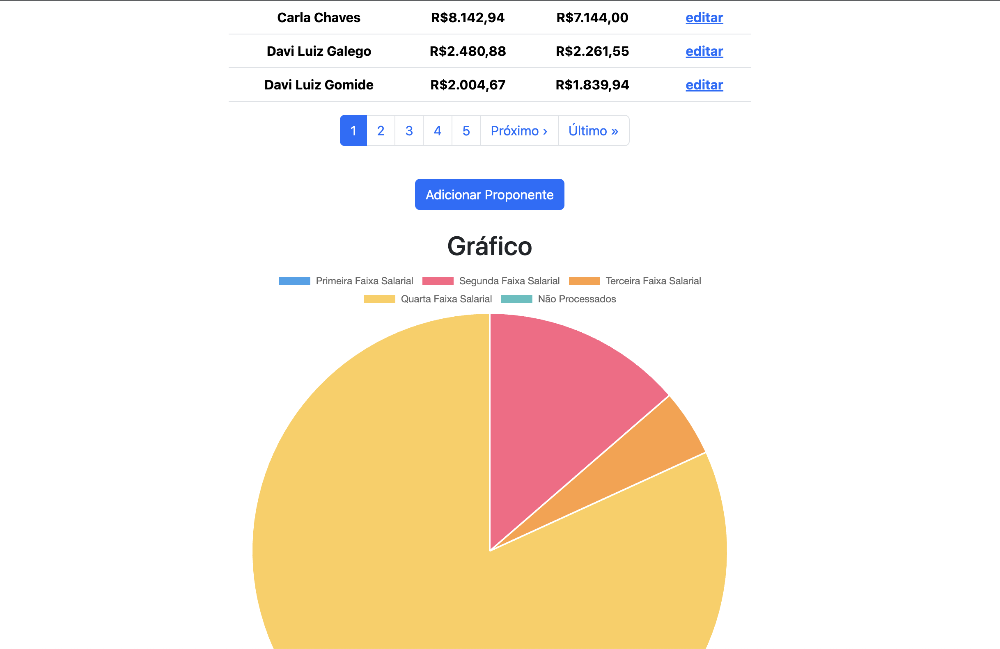

# Desafio Desconto INSS

Criar uma aplicação “Desconto INSS” no Rails com os seguintes requisitos:

- Rails 5 +;
- PostgreSQL;
- Bootstrap;
- Chart.js;
- Rubocop rails;
- Kaminari;
- Redis;
- Sidekiq.

## Especificações

As especificações podem ser encontradas em: [Especificação Funcional](especificacoes.md)

## Observações

- Iniciar com pelo menos 10 registros (seed);
- Atualizar salário do funcionário usando mensagens/jobs (redis/sidekiq);
- Ao final da programação, utilizar o rubocop-rails e padronizar o seu
  projeto de acordo com as boas práticas de programação rails.

## Sugestões

- Abordagem TDD (escreva testes, disse o mestre!);
- Dockerização (portátil é bom);
- Autenticação (desejável).

## Notas do Desenvolvedor

Um bom desafio executado em um pouco mais do que 48 horas corridas. Se fossemos levar para produção precisariamos rever alguns pontos criticos para a performance. No tempo ficou faltando o form, que poderia ter sido feito com simple_form ou algo do gênero. Admito que estava um pouco enferrujado nas views dentro de uma app monolitica.

Entre os recursos implementados posso dar destaque aos seguintes pontos:

- O Service Object que faz o calculo do desconto. O service recebe o salário, que pode ser um integer ou um float e usa o design pattern Chain Responsability para percorrer as faixas salariais e fazer o calculo. Retorna o salário como float, o desconto, o indice e a faixa salarial;
- Endereço e telefone, esse último com STI, em classes independentes relacionadas com o proponente, mais faceis para o gerenciamento;
- Libs com classes utilitárias para validações, mascaras ou dados gerais;
- Utilização dos conceitos de Clean Arquiteture adaptadas as boas práticas do Ruby/Rails;
- Rake Tasks para atualizar todos os salários ou os que não foram processados;
- Seed com FactoryBot + Faker.

Entre os pontos que poderiam melhorar e não foram implementados ficaram:

- As views com um partial do form;
- Fazer uma requisição websocket para atualizar o desconto do salário assim que o campo fosse preenchido;
- Maior cobertura de testes, principalmente nos controllers e nas views;
- Dockerizar a aplicação, como foi sugerido;
- Implementar a autenticação com Devise;
- Melhorar a experiência do usuário, garantir a responsividade;
- Criar as instruções de uso desta aplicação.

Agradeço a oportunidade. E após a avaliação esse repositório deverá ganhar as adições sugeridas conforme surja tempo, pois é um projeto interessantissimo para o estudo.

