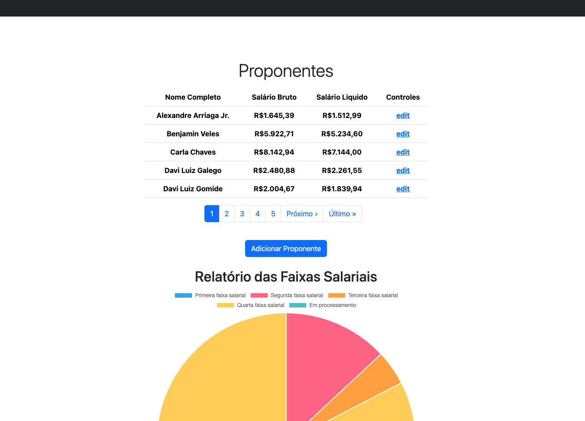

# Desafio Desconto INSS

Criar uma aplicação “Desconto INSS” no Rails com os seguintes requisitos:

- Rails 5 +;
- PostgreSQL;
- Bootstrap;
- Chart.js;
- Rubocop rails;
- Kaminari;
- Redis;
- Sidekiq.

## Especificações

As especificações podem ser encontradas em: [Especificação Funcional](especificacoes.md)

## Observações

- Iniciar com pelo menos 10 registros (seed);
- Atualizar salário do funcionário usando mensagens/jobs (redis/sidekiq);
- Ao final da programação, utilizar o rubocop-rails e padronizar o seu
  projeto de acordo com as boas práticas de programação rails.

## Sugestões

- Abordagem TDD (escreva testes, disse o mestre!);
- Dockerização (portátil é bom);
- Autenticação (desejável).

## Instalação

Essa aplicação está dockerizada, o que permite sua instalação com poucos comandos. Siga as instruções:

### Instalando o Docker:

Se o Docker ainda não estiver instalado em seu sistema, siga as instruções adequadas para o seu sistema operacional:

#### Windows ou macOS:

Baixe o Docker Desktop do [site oficial do Docker](https://www.docker.com/products/docker-desktop) e siga as instruções de instalação para um dos sistemas.

#### Linux:

Use o gerenciador de pacotes da sua distribuição para instalar o Docker. As instruções específicas variam entre distribuições, mas geralmente envolvem a execução de comandos como `sudo apt-get install docker-ce` (para o Ubuntu) ou equivalentes para outras distribuições.

### Contruindo o banco de dados e o Seed:

- Após instalar o **Docker** abra um terminal no diretório raiz da aplicação (onde está localizado o arquivo `docker-compose.yml`).
- Execute os seguintes comandos:

```bash
docker-compose build

docker-compose up -d

docker-compose run backend bundle exec rails db:create

docker-compose run backend bundle exec rails db:migrate

docker-compose run backend bundle exec rails db:seed

docker-compose down
```

Esses comandos por ordem farão o seguinte:

- Irá fazer o build dos services;
- Subirá os containers serviços com a opcão detached, liberando o console;
- Criará os bancos de dados necessários;
- Fará a migração das tabelas necessárias;
- Rodará o Seed, populando o banco de dados;
- Desligará os containers dos serviços;

### Rodando a aplicação:

Uma vez que sua aplicação esteja instalada e o banco configurado, abra um terminal no diretório raiz da aplicação (onde está localizado o arquivo `docker-compose.yml`). Rode o seguinte comando:

```bash
docker-compose up -d
```

Sua aplicação Rails estará acessível em http://0.0.0.0:3000, e o Sidekiq em http://0.0.0.0:3000/sidekiq.

Para parar os contêineres, execute o seguinte comando no mesmo diretório:

```bash
docker-compose down
```

## Testes

Faltou uma maior cobertura de testes nos controles e nas view, mas com uma cobertura necessária para fazer as classes de backend com **TDD**. Seguem os resultados:

```bash
Utilities::Cpf
  #valid?
    with valid cpf
    with valid formatted cpf
    with invalid cpf
    with invalid lenght cpf
  #masked
    generate mask for a valid cpf
    generate error for a invalid cpf
  #formatted
    format a valid cpf
    format a formatted valid cpf
    generate error for a invalid cpf

Utilities::Email
  #valid?
    with valid email
    with invalid email
  #masked
    generate mask for a valid email
    generate error for a invalid email

Utilities::Phone
  #valid?
    with valid phone
    with valid formatted phone
    with invalid phone
    with invalid lenght phone
  #formatted
    format a valid phone
    format a formatted valid phone
    format a valid celular
    format a formatted valid celular

Address
  associations
    is expected to belong to proponent required: true
  validations
    valid attributes
    is expected to validate that :address cannot be empty/falsy
    is expected to validate that :number cannot be empty/falsy
    is expected to validate that :zip_code cannot be empty/falsy
    is expected to validate that :city cannot be empty/falsy
    is expected to validate that :neighborhood cannot be empty/falsy
    is expected to validate that :uf cannot be empty/falsy
    is expected to allow :complement to be ‹""› or ‹nil›

Phone
  associations
    is expected to belong to proponent required: true
  validations
    valid attributes
    is expected to validate that :number cannot be empty/falsy
    is expected not to allow :number to be ‹"11 23455576"›
    is expected to validate that :type cannot be empty/falsy

Proponent
  associations
    is expected to have one address
    is expected to have many phones
  validations
    valid attributes
    is expected to validate that :full_name cannot be empty/falsy
    is expected to validate that :birth cannot be empty/falsy
    is expected to validate that :cpf cannot be empty/falsy
    is expected to validate that :email cannot be empty/falsy
    is expected not to allow :cpf to be ‹"555.321.444-12"›
    is expected not to allow :email to be ‹"ze.da.roca.com"›
    not greater than 110 years old
    not future travelers
    never salary equal nil
    net salary

DiscountCalculationService
  valid salary
    first band
      #discount
      #salary_band
      #aliquot
    third band
      #discount
      #salary_band
      #aliquot

Finished in 0.42939 seconds (files took 7.04 seconds to load)
54 examples, 0 failures
```

Os testes podem ser executados com o seguinte comando na raiz da aplicação:

```bash
docker-compose run backend bundle exec rspec spec/*
```

Para finalizar os containers após os teste não esqueça de rodar:

```bash
docker-compose down
```

## Notas do Desenvolvedor

Um bom desafio executado em um pouco mais do que 72 horas corridas. Se fossemos levar para produção precisariamos rever alguns pontos criticos para a performance. Admito que estava um pouco enferrujado nas views dentro de uma app monolitica.

Entre os recursos implementados posso dar destaque aos seguintes pontos:

- O Service Object que faz o calculo do desconto. O service recebe o salário, que pode ser um integer ou um float e usa o design pattern Chain Responsability para percorrer as faixas salariais e fazer o calculo. Retorna o salário como float, o desconto, o indice e a faixa salarial. Outro ponto de foco nesse Service é que ele usa metaprogramação para criar dinamicamente os objetos necessários;
- Endereço e telefone, esse último com STI, em classes independentes relacionadas com o proponente, mais faceis para o gerenciamento;
- Libs com classes utilitárias para validações, mascaras ou dados gerais;
- Utilização dos conceitos de Clean Arquiteture adaptadas as boas práticas do Ruby/Rails;
- Rake Tasks para atualizar todos os salários ou os que não foram processados;
- Seed com FactoryBot + Faker.

Entre os pontos que poderiam melhorar e não foram implementados ficaram:

- Maior cobertura de testes, principalmente nos controllers e nas views;
- Implementar a autenticação com Devise;
- Melhorar a experiência do usuário, garantir a responsividade.

Agradeço a oportunidade. E após a avaliação esse repositório deverá ganhar as adições sugeridas conforme surja tempo, pois é um projeto interessantissimo para o estudo.


